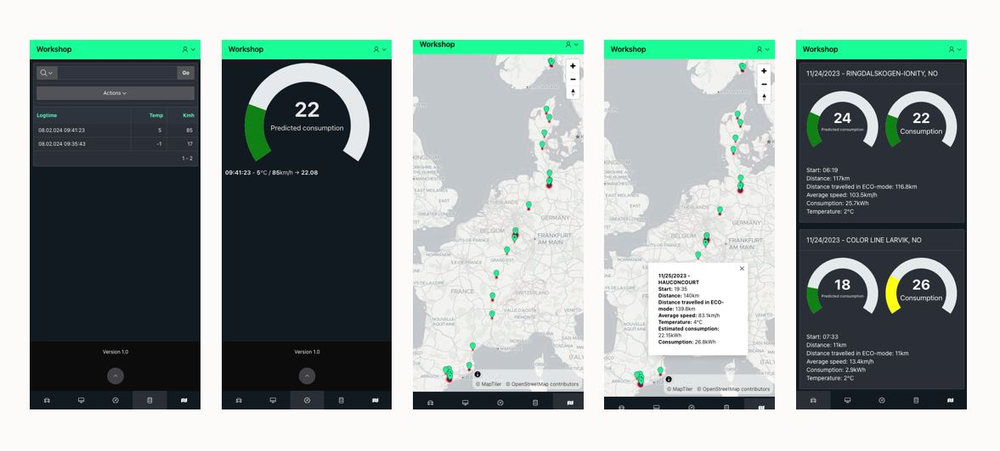
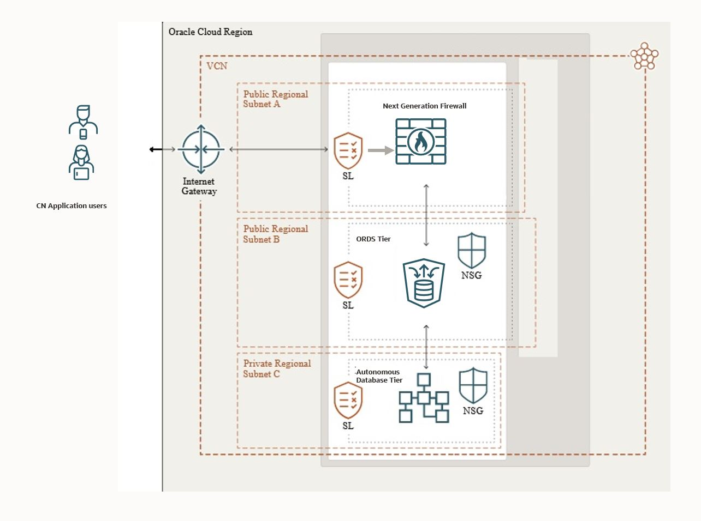
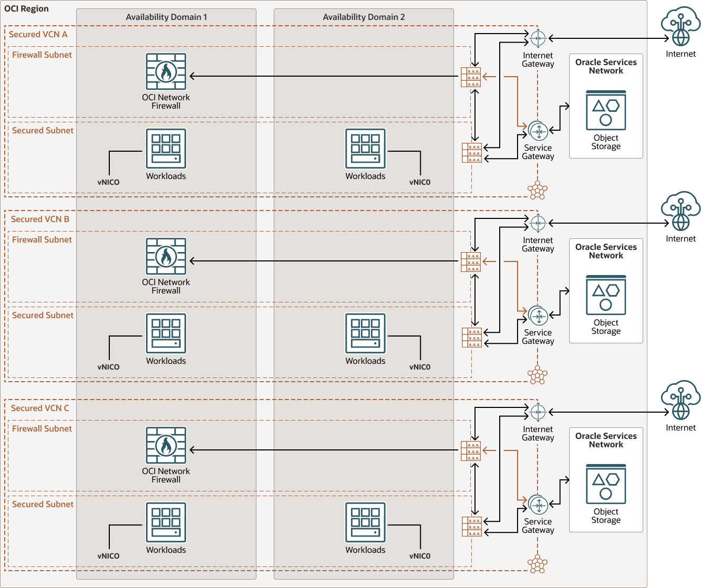
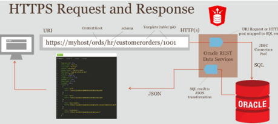

# BMW EV Machine Learning Workshop 

This is a fun workshop where we use machine learning trained with 
data collected from a BMW EV, to predict :chart_with_upwards_trend: KWh consumption based on :stopwatch: speed and :thermometer: temperature. We will integrate a Microcontroller with a sensor to a database over REST
and present the prediction on tiny cool mobile app, using REST to the ML service
  
Brought to you by:  
Frode Pedersen, frode.pedersen@oracle.com  
Inge Os, inge.os@oracle.com   
Renee Wikestad,  renee.wikestad@oracle.com  
Daniel Ivanescu, daniel.ivanescu@oracle.com

## Summary

The target of the workshop is to learn how you may integrate autonomous database with machine learning and edge devices in a secure way.

The workshop bases the AI Predictions on data collected with a BMW i4 M50 EV from Oslo to Spain, collecting speed, temperature, power consumption in KWH, altitude and location.
The collected data is the use to generate a ML based regression, for predicting power consumption based on speed and temperature.
The real-time temperature and speed are collected via a microcontroller programmed with micro Python, feeding real-time data into Autonomous Database 
via REST, the prediction is then visualized and presented to the user on a mobile device with APEX.
As the IoT world might be dangerous, it is important to protect the database, so only the required REST AP is exposed to the IoT device.

  

  
Below are some screenshots from the APEX app we will install:  




### Secure communication with Oracle Database over REST

Oracle Data Rest Services, ORDS, is the technology for exposing and updating data in an Oracle Autonomous Database via REST Services.  
ORDS is a major security feature, and the most important properties of ORDS from a security point of view are:  
-	No SQL connection is exposed, only REST. Developer can select and manipulate data with REST, and the SQL connection is not exposed.  
-	All Communication is over HTTPS; a protocol that is easy to route and can be routed through Next Generation Firewalls like the Palo Alto powered OCI Firewall.  
-	Most important, it is the developer of the RST API that defines the SQL statement or PL/SQL statement behind the REST API. No other SQL will be permitted, and the SQL behind the REST service is not exposed.  
-	Authentication and authorization are under control of either the ORDS server, with OAUTH or under the control of the Autonomous database authentication and authorization.  
Where do ORDS differ from building yours own API written in a language like node.js or Python? The main difference is a) the security and b) the simplicity. You write no other code than PL/SQL or SQL that is behind the REST API, ORDS via metadata handles the rest.  
In this lab we will demonstrate how you easily can add database updates from a tiny IoT edge to Autonomous via ORDS REST API, apply Machine Learning on the data, protected by the authorization of the Autonomous Database, and visualize the data in a simple secure APEX application.  

  
  
### Protect ORDS REST API with Oracle OCI Next Generation Firewall

In interest of time, configuration of the Firewall, and building a complete OCI network with the NGFW is not a part of the lab.
The architecture can easily be extended run Oracle ATP on a private IP only and filter all ORDS REST API through the NGFW.
For details please refer to: [OCI Network Firewall](https://docs.oracle.com/en/solutions/oci-network-firewall/index.html#GUID-875E911C-8D7D-4205-952B-5E8FAAD6C6D3)  

  


## Using Machine Learning and predictions in Autonomous Database
  
Machine Learning in Oracle Database supports data exploration, preparation, and machine learning (ML) modeling at scale using SQL, R, Python, REST, automated machine learning (AutoML), and no-code interfaces.  
- More than 30 high performance in-database algorithms producing models for immediate use in applications. 
- Keeping data in the database, no need to move or copy data. 
With Oracle ML organizations can simplify their overall architecture and maintain data synchronization and security. It enables data scientists and other data professionals to build models quickly by simplifying and automating key elements of the machine learning lifecycle. Oracle ML is included in the license of any Oracle Database Edition.
  

## Workshop goal

The aim for the workshop is to build a Mobile APEX application that consumes sensor data,
and based on the sensor data applies Machine Learning to create a prediction.

In the lab we will explore Machine Learning, Vector search, Security Architecture, REST and SQL united, Low Code Development  
The prediction will be visualized in APEX
  
As Sensor we use an Arduino device with micro python that posts sensor-data via REST to an autonomous database.
  
The sensor collects data and ingest into a IOT sensor log-table, vs. the APEX application extract the latest IOT data
and display the predictions.
  
As sample data we will use a set of data collected from a BMW EV from a trip from Oslo to Spain,
that is uploaded into the Autonomous DB, and the appl Oracle DB built in machine learning, ML.
  
For the lab you may either use a python script where the sensor-data is manually entered or use the micro python code from the device.

### Workshop Agenda
 
- Welcome and introduction
- 23ai update
- Lab 1: Data Model creation and data load
- Lab 2: AI and ML lab
- Vector Lab: Vector search and select AI demo Notebook
- Lab 3: REST and JSON Duality view
- Lab 4: Circuit Python sensor lab
- Lab 5: APEX Low code development, Ai generated 

## Configuration of the workshop in your own autonomous database

If you want to configure the workshop envrionment in your on autonomous databas ein your tenancy, follow these [steps](files/setup.md)

## Workshop Overview


### Hardware (if you want to order your own)  

[Hardware list](files/hardware_order.md)  

### URL for the labs

Details are found at [https://github.com/bios62/labinfo/blob/main/README.md](https://github.com/bios62/labinfo/blob/main/README.md)  
  
Assume your userid is user25 and your password is password25.  

The URL to the APEX Workspace is:

> https://<your ATP instance>.adb.eu-frankfurt-1.oraclecloudapps.com/ords/r/apex/workspace-sign-in/oracle-apex-sign-in
  
**The description below applies if Database Actions, SQL Developer Web is to be used**  
**In the current workshop, SQL Developer Web is not used**  
With the URL to Autonomous like:

> https://myautonomous.adb.eu-frankfurt-1.oraclecloudapps.com  

The formal structure of the URL to database actions is:  

> https://<URL to autnomous>/ords/<dbusername>/_sdw/?nav=worksheet

The URL to database actions, with SQL, ML and ORDS in this example will be:  
  
> https://myautonomous.adb.eu-frankfurt-1.oraclecloudapps.com/ords/user25/_sdw/?nav=worksheet

**The URL to the APEX Workspace is:**  

> https://<your ATP instance>.adb.eu-frankfurt-1.oraclecloudapps.com/ords/r/apex/workspace-sign-in/oracle-apex-sign-in

Prior to the workshop, clone the git repo to you local disk  
  
### Workshop part 1

In this lab we will create tables and upload training data, by the usage of Jupyter Notebook   
[Instructions Lab 1](labs/lab1.md)

### Workshop part 2

In this lab you will create the different AI ML models, and test/verify your models. 
  
  
**Machine leaning Notebook**  
  
The lab is run as a Notebook. Import the Notebook [lab2.dsnb](files/lab2.dsnb) and follow the Notebook instructions 
  
> :warning: As shown in lab1, remember to switch notebooktype from `low` to `tp`
 
  
### Workshp Vector serach and select AI Lab

New version will be pushed, stay tuned

###  Workshop part 3

There are several types of interaction between the database back-end and a typical Cloud Native app you may define in Oracle23ai.  

In this lab two types will be created:  
- GET REST API over Oracle Rest Data Services ORDS
- POST API over Oracle JSON duality view, with multiline inserts.
  


The following API will be built:  

``` http
GET /wsapi/kmh  , get the latest speed reading  
GET /wsapi/predict?kmh=xxx&temp=xxx  make a prediction based on temp reading from the sensor and the latest speed reading  
GET /currentvalues/  retrieves the latest set of sensor values
POST /sensorapi/   for circuitpython, updates latest sensor reading
```

The lab is run as a Notebook. Import the Notebook [lab3.dsnb](files/lab3.dsnb) and follow the Notebook instructions  
This Notbook is imported in OML Native format  

If you have cloned or downloaded the git repo, upload from your local filesystem  
**As shown in lab1, remember to switch notebooktype from low to tp**  
  
## Workshop part 4
#### Python Lab  
In this lab a Arduino based microcontroller for a temp sensor will be used to report current_temp to the log-data table  
The Arduino does not have a speed sensor, and the REST API used is /sensorapi that supplements the log-data record with the most recent value from the current_speed table.  

[Instructions Lab 4 Arduino](labs/lab4-arduino.md) 

## Workshop part 5

Presentation of the APEX app, view [here](../files/Build with Low Code (APEX).pdf)

In this lab you will logon to your apex environment and upload an APEX application that displays the predicted power consumption at the current temp/speed.
  
You have a predefined APEX workspace, with the same username/password as your database actions username/password

[Instructions Lab 5](labs/lab5.md)  

## Workshop part 6

Simulate or add real sensor-data
Run APEX app and visualize prediction  

## Links and supporting documentation

![Arduino developer environment] (https://link-url-here.org)https://codewith.mu/)

## Pictures


  
  The device
    

  
  Der Wagen

## License

Copyright (c) 2024 Oracle and/or its affiliates.

Licensed under the Universal Permissive License (UPL), Version 1.0.

See [LICENSE](https://github.com/oracle-devrel/technology-engineering/blob/main/LICENSE) for more details.
