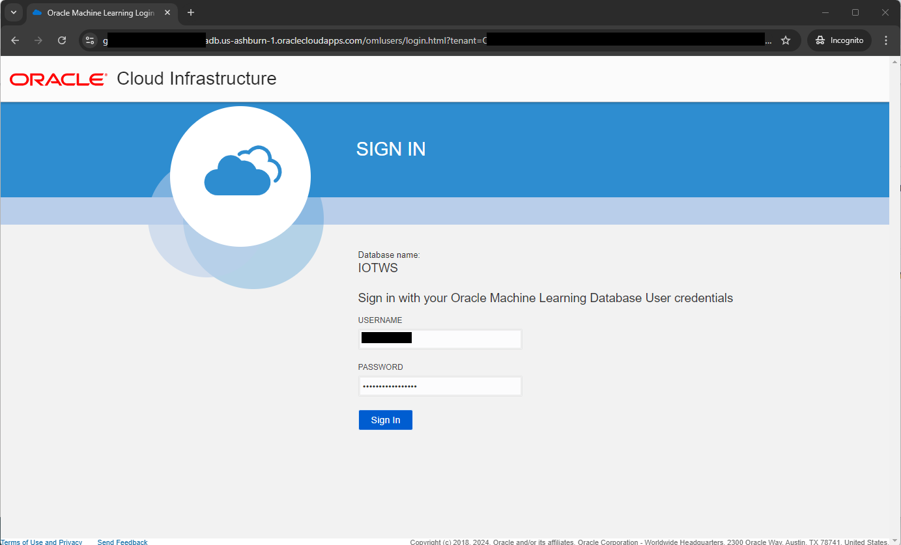
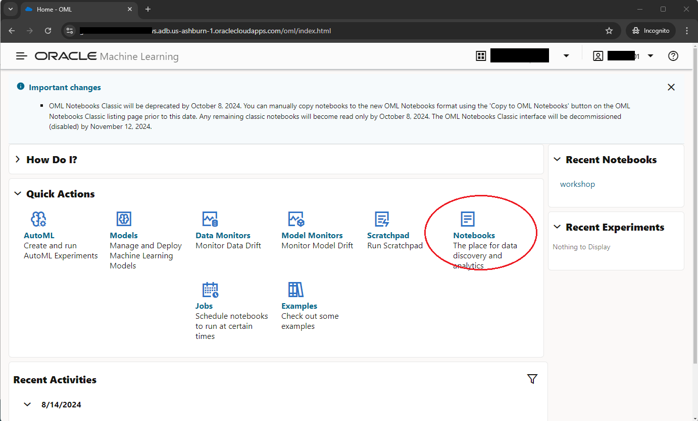
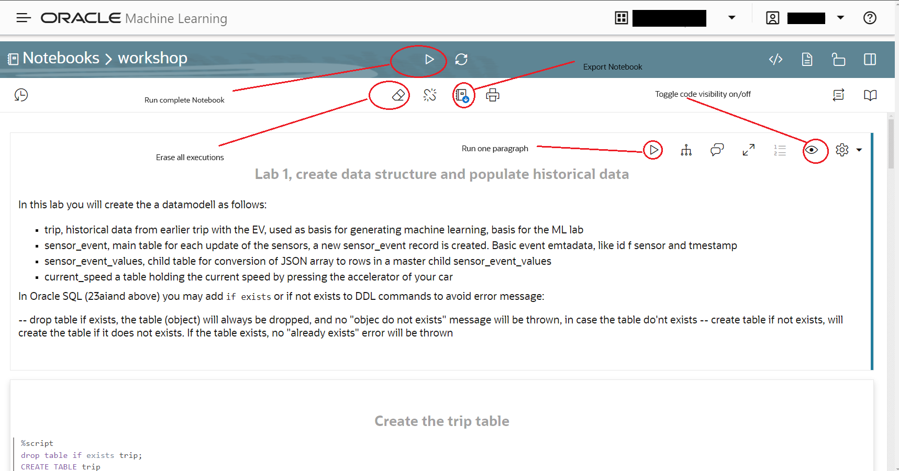
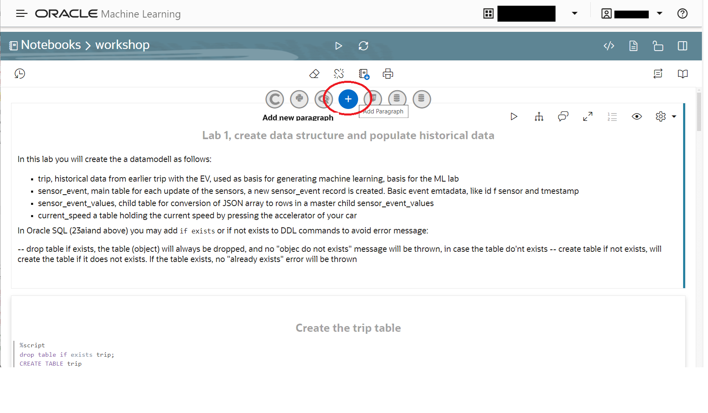

# Lab 1 instructions

## Purpose of lab

The purpose of this lab is to learn how to use the embedded Notebook of Autonomous,  
and with the Notebook run Python and SQL against the infrastructure.  

The first step is to create the data-model required and upload historical data for ML processing.

## Prerequisite

You will get username, password and URL to the autonomous database from the instructor.  

## Instructions

The process is:
- logon to the notebook
- Import the default workspace
- Visit the notebook, and build the data-model step by step

## Notbook usage

Copy/paste the given URL to the notebook
  
Sign in with username and password  
  
  
After logon you will see the screen below, in the screen click on Notebooks

You will have a default workspace, where all your workbooks will be listed.

Select Import, and select the lab1.ipynb from the files directory in your cloned git repo

  
Import [file/lab1.dsnb](../files/lab1.dsnb)

After the import you will see this screen:  

Click on the workbook named lab1

A quick tour on the Notebook user interface
Each element are kept in a paragraph, a paragraph is of type %md (markup), %python (Python code), %sql (SQL code, single statement), %script (several SQL statements)  

Each paragraph is edited by hover over and select the eye, and tick the code box
Each paragraph can by run with the > button
Each paragraph can be run with the run button on the top
By overing between two paragraphs, you may add a new code line with the + sign  
  
The most common features of the Notebook are shown below

  

Before executing any SQL code, verify the SQL connection, it should be set to to TP or TP_URGENT

The next step is to execute the code in the Notebook step by step and get a understanding of the data-model

