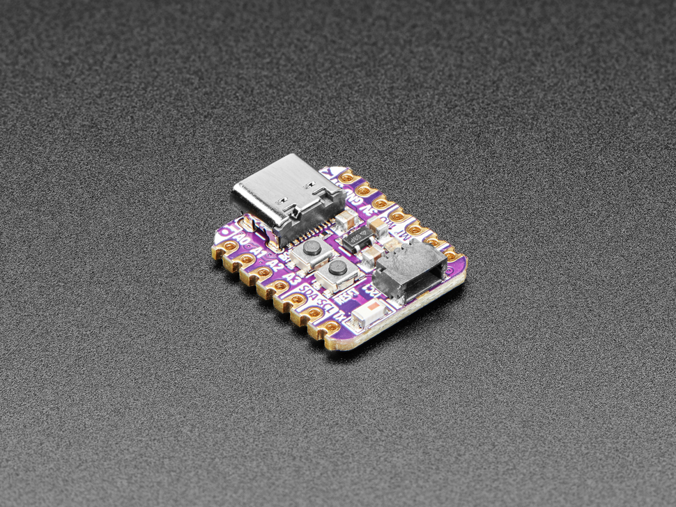
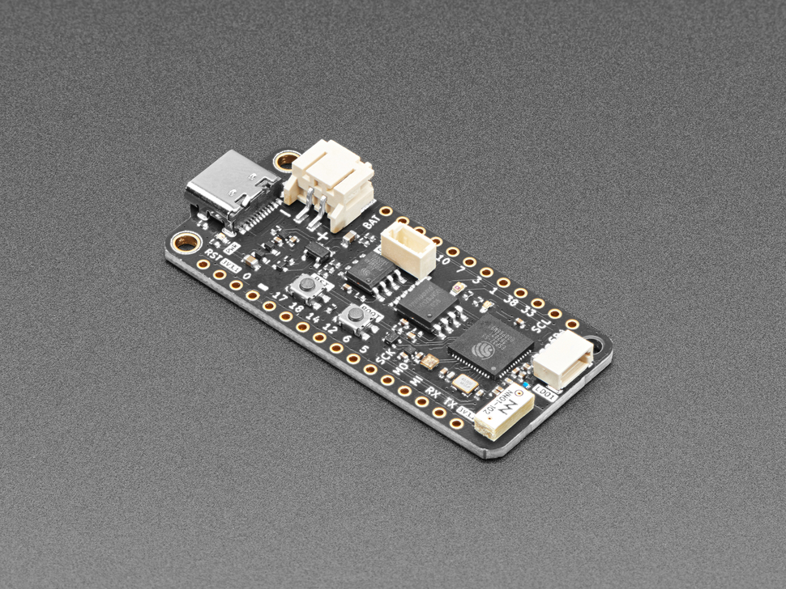
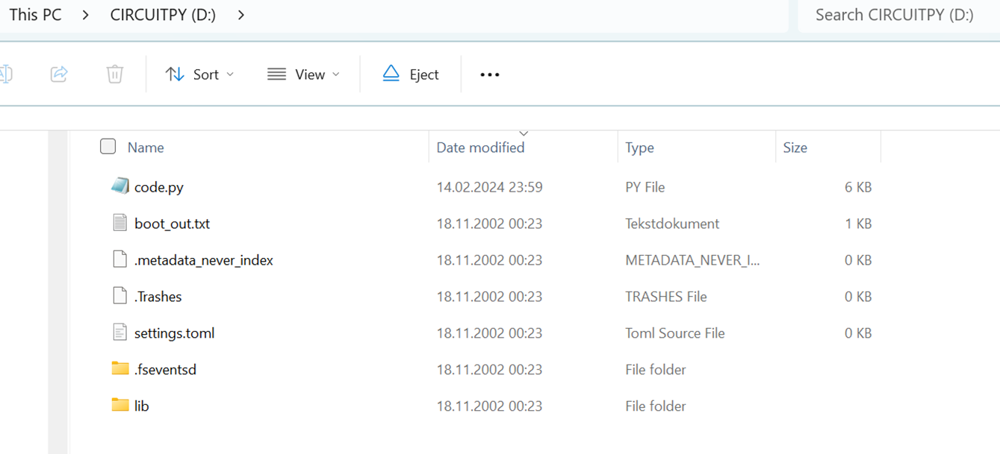
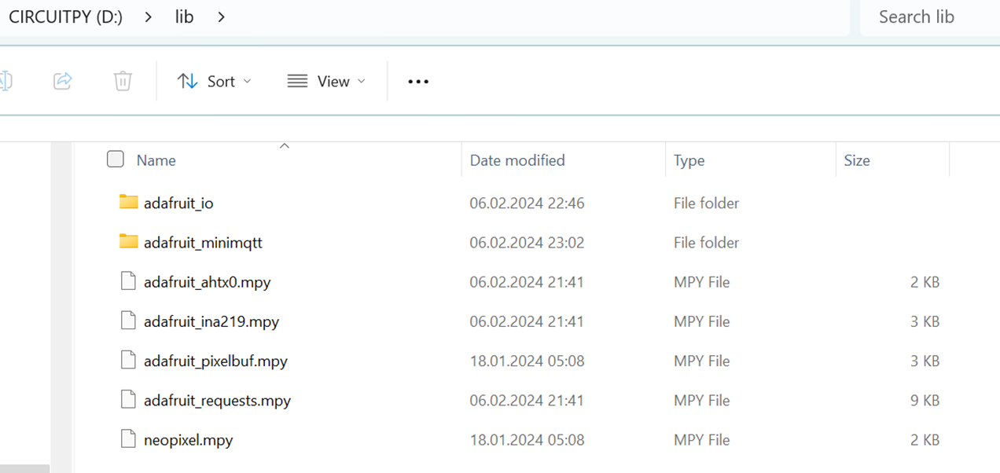
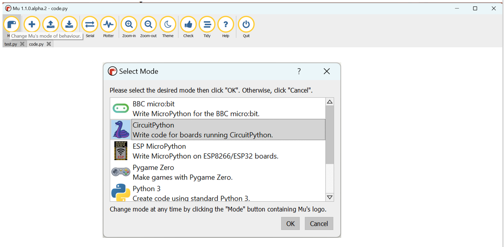
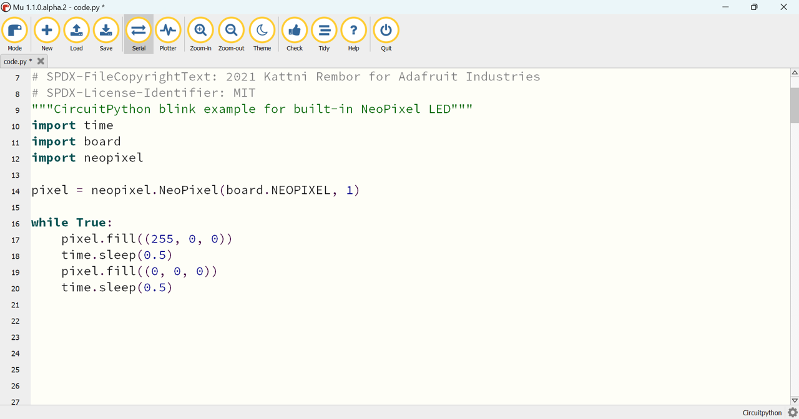
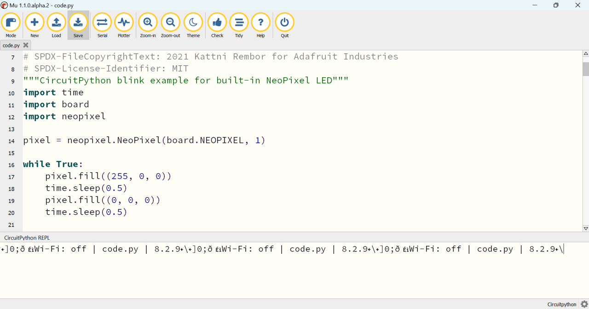

# Lab 4 (Microcontroller) instructions  

In the lab we will use one out of two devices:  

- Adafruit QT Py ESP32-S2 WiFi Dev Board,  Documentation: [https://www.adafruit.com/product/5325](https://www.adafruit.com/product/5325)
- FeatherS3 - ESP32-S3 Development Board by Unexpected Maker, Documentation: [https://www.adafruit.com/product/5399](https://www.adafruit.com/product/5399)

The QT Py ESP32-S2 board:  
  


FeatherS3 - ESP32-S3 board:  
  



## Purpose of lab

The purpose of this lab is:  
- Get a basic understanding and prepare the Circuitpython environment on the ESP32 Microcontroller.
- Configure and run the program that post temperatures to the database

## Prerequisite

For the lab you will get an ESP32 Microcontroller, an AHT20 Temperature and Humidity Sensor, and a small I2C (Inter Integrated Circuit) -cable, to connect them together.  

You will need a USB-C data cable for use between your Laptop/Mac and the USB C plug on the ESP32 board. 

**Hardware order list**  
  
AHT20 - TEMPERATURE & HUMIDITY Sensor:  
[https://www.digikey.no/no/products/detail/adafruit-industries-llc/4566/12396895](https://www.digikey.no/no/products/detail/adafruit-industries-llc/4566/12396895)  
  
	
FEATHERS3 ESP32-S3 DEV BOARD:  
[https://www.digikey.no/no/products/detail/adafruit-industries-llc/5399/16499351](https://www.digikey.no/no/products/detail/adafruit-industries-llc/5399/16499351)  
   
	
JST SH 4-PIN CABLE:  
https://www.digikey.no/no/products/detail/adafruit-industries-llc/4210/10230021


## Instructions

Unpack both boards. Try not to touch the 3x3 mm blank sensor - it will hurt its accuracy if you do. 

## Step 1 - Hardware
  
The small cable and plugs are easy to damage so, first look at cable and identify the small blank metal pins on the plugs.  Locate the AHT20 text on the sensor-board and with the text oriented in the correct way - Carefully plug one end of the cable into the left white sockets - with the metal pins pointing down.  Then plug the other end into the white socket of the ESP32 controller.

The two plugs on the AHT20 sensor is actually identical, and can be used to daisy chain multiple sensor.  To reduce failure rate of the cable sockets, try to not remove cable from device.  It is better to unplug at the AHT20 because you have two sockets - one spare if it gets damaged.  


## Step 2 - Prepare the  QT Py ESP32-S2 device

The ESP 32 device needs to be flashed with a new boot loader that runs circiut python
FeatherS3 device is peloaded with circiut boot loader

The steps to prepare the device is:
- Flash the device
- Add new boot loaded with circiut python
- Load the library package onto the device
  
### Flash the device (QT Py ESP32-S2 Only) 
  
The new device is flashed as follows:  
- Plug the USB cable into Laptop and QT Py ESP32-S2 controller.  
- The LED lamp on the QT Py ESP32-S2 will start displaying different colors.  
- You should now get a new USB drive on your Laptop.  
- Look at the picture of the QT Py ESP32-S2 and identify the boot button inside the red rectangle. 

- Put the ESP32 into boot mode by double clicking the button two times with approx. 1 second between.  If successful LED lamp turns Green.  If not - retry until successful.  
- A new drive will appear on your laptop.  

### Download circiut python boot loader for the QT Py ESP32-S2 device.
  
Feather S3 is factory-loaded with Circiut PY V8 boot loader.

The software bundle for circiut python is available under `files` in the git repo.
If the latest version is required it can be downloaded from Adafruit.

Circiut python currently are on release 9. Both 8 and 9 may be used.
The Feather S3 device is preloaded with release 8 of circiut python.

Version 9 (Latest version):  
`adafruit-circuitpython-adafruit_qtpy_esp32s2-en_US-9.1.3.uf2`  
Version 8:  
`adafruit-circuitpython-adafruit_qtpy_esp32s2-en_US-8.2.10.uf2`  

For the lab we recommend V9, but it is not long term tested  


Both version 8 and version 9 of the bootloader is downloaded and stored in the `files` directory.  

copy `files/adafruit-circuitpython-adafruit_qtpy_esp32s2-en_US-9.1.3.uf2` or  
`files/adafruit-circuitpython-adafruit_qtpy_esp32s2-en_US-8.2.10.uf2` to the new drive.  
You will probably get an error message when the ESP32 reboot with the new software.  
  
Reboot with the reboot button  

If the bootloader is working correctly, you should now have a drive CIRCUITPY similar to the picture below:   



Adafruit maintains circiut python 9, and the latest version can be downloaded from [here](https://circuitpython.org/board/adafruit_qtpy_esp32s2/)  or [All versions here](https://adafruit-circuit-python.s3.amazonaws.com/index.html?prefix=bin/adafruit_qtpy_esp32s2/en_US/)  


### Load circiut python libraries

The next step is to copy the required library files onto the device.  
Download and copy the correct version of the library ip file, and copy the libraries onto the device.  
The library bundle is dependent on the bootloader version.  

- Version 8 bootloader use: [adafruit_lib_V8.zip](../files/adafruit_lib_V8.zip) 
- Version 9 bootloader use: [adafruit_lib_V9.zip](../files/adafruit_lib_V9.zip) 

**V9 library files (QT Py ESP32-S2)**  
  
Download and unzip: [adafruit_lib_V9.zip](../files/adafruit_lib_V9.zip)  
  
The library files are:
- yourdownloaddir\lib\adafruit_ahtx0.mpy
- yourdownloaddir\lib\adafruit_connection_manager.mpy
- yourdownloaddir\lib\adafruit_neopxl8.mpy 
- yourdownloaddir\lib\adafruit_requests.mpy
- yourdownloaddir\lib\neopixel.mpy
- yourdownloaddir\lib\adafruit_io  (directory)

Unzip `adafruit_lib_V9.zip` to a local temp directory. Copy all files and dietories in the lib folder to the lib folder on the device


**V8 library files (QT Py ESP32-S2 or FeatherS3)**  
  
Download and unzip: [adafruit_lib_V8.zip](../files/adafruit_lib_V8.zip)  

The library files are:

- yourdownloaddir\lib\adafruit_ahtx0.mpy
- yourdownloaddir\lib\adafruit_pixelbuf.mpy
- yourdownloaddir\lib\adafruit_ina219.mpy 
- yourdownloaddir\lib\adafruit_requests.mpy
- yourdownloaddir\lib\neopixel.mpy
- yourdownloaddir\lib\adafruit_io  (directory) 
- yourdownloaddir\lib\adafruit_minimqtt (directory) 

Files to be copied (V8):  

  

**Test of the device**

 
Copy the  [files/blink/code.py](../files/blink/code.py) from the blink folder under files to CIRCUITPY top directory.  
The device should start blinking RED with a frequency of 1 HZ.  

**Adafruit download**

The following description is a suplementary description and the step is not reuired, if the supplied device and sensor is used.  
  
Skip this step if the library packages in the repo are used.  

A stripped down bundle is used above. To preserve memory, only the requred files has been include din the bundle.  
If the latest version is required, or additional sensors is required, the complete bundle may be downloaded from Adafruit at  
[https://circuitpython.org/libraries](https://circuitpython.org/libraries)  
  
  
Version 9 libraries: [adafruit-circuitpython-bundle-9.x-mpy-20240827.zip](https://github.com/adafruit/Adafruit_CircuitPython_Bundle/releases/download/20240827/adafruit-circuitpython-bundle-9.x-mpy-20240827.zip)  
Version 8 libraries: [adafruit-circuitpython-bundle-8.x-mpy-20240827.zip](https://github.com/adafruit/Adafruit_CircuitPython_Bundle/releases/download/20240827/adafruit-circuitpython-bundle-8.x-mpy-20240827.zip)  

Documentation of the Circiut Python API:

[](https://circuitpython.org/libraries)
[](https://docs.circuitpython.org/projects/requests/en/latest/api.html)
  
## Step 3 - Download Micropython Development Environment and install it
  
The recommended IDE for Circuity Python development, **mu** is found [here](https://codewith.mu/)  
  
For developing python code it is recommended to use MU development Environment, which can be downloaded from: 

[https://codewith.mu/en/download](https://codewith.mu/en/download)  

## Step 4 - Prepare and test MU for ESP32-S2

Start the MU environment - and select mode in upper left corner and the select CircuitPython  



paste the contents of  code.py from one of the blink directories from GIT into the upper window, and use save button to run it.  



use the serial button to open the output window - where all text from print commands will show up  
  
  
  
You can now get a little bit experience with the ESP32 Circuitpython by changing the RGB (Red Green Blue) parameters to values between 0 and 255.  Every time you save file, the ESP32 will run the new version of the program.  

You can also copy the lines with RGB and the following delay one or more times and change the colors and delays - to create more colorful blink sequences.  

The other blink directories also contain versions of code.py with different blink sequences.  

## Step 5 - Configure and start the code_lab4.py from the sensor directory

Open [files/code_lab4.py](../files/code_lab4.py) program in a text editor.    

This program connects to a wifi network - use your phone or the network provider by your instructor.  
Program will then attempt to post temperature to the database.  

Before running you must change the wifi parameters and the uri to your database schema.  

**Set the URI for REST APIs**  

Set the REST_URI and WORKSHOP_USER for your database envrionmen 
```
REST_URI = 'https://<mydatabase>.adb.eu-frankfurt-1.oraclecloudapps.com'
WORKSHOP_USER = 'someuser'
```
Set your wifi conenction   
  
```
wifi_networks = {
    "mobile": {"wifinamename": "mobilenet", "ssid": "secret1"},
    "home": {"wifinamename": "myhomenet", "ssid": "secret2"},
}

```  

Click on the serial button on the top meny, to open the serial monitor.  

Save the file to the device CIRCUITPY drive, top directory, under the name `code.py`, and you should see debug text in the lower window - while the LED will change colors while the program first tries to connect wifi, reads sensor, and then posts to the database.  

You can also use your breath to try to warm the sensor and see if you get a temperature change.  

If you unplug the I2C cable from the sensor, the program will go into a test mode where it will post a message with  temperature 22c.  
You sometimes need to restart the device after plugging/unplugging by saving the Python program to the device - or pressing the restart button on the device.  

Look in the database - and see that you get a new post approx once every minute.  
Also identify the sequence of the LED colors while program is running and compare to text in MU.  
Leave the program running in MU.    

If the program crash - the led will start slow red blinking. and we can look for the error message in MU.  don’t close window - because this is info is necessary for improving the program.  
